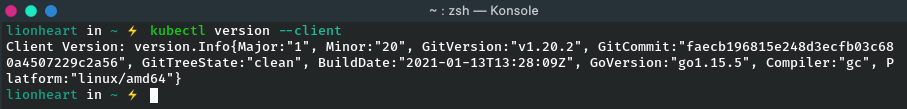

# Setting up a Kubernetes Cluster

The simplest and quickest path to a fully functioning Kubernetes cluster is by using
Minikube. Minikube is a tool that sets up a single-node cluster that’s great for both
testing Kubernetes and developing apps locally.

## Installing Minikube
Minikube is a single binary that needs to be downloaded and put onto your path. It’s
available for OSX, Linux, and Windows. To install it, the best place to start is to go to
the Minikube repository on GitHub (http://github.com/kubernetes/minikube) and
follow the instructions there.

## Starting a Kubernetes cluster with Minikube

Once you have Minikube installed locally, you can immediately start up the Kuberne-
tes cluster with the command in the following listing.

```bash
minikube start --driver=docker
```


Starting the cluster takes more than a minute, so don’t interrupt the command before
it completes.

## Installing Kubernetes Client (kubectl)

To interact with Kubernetes, you also need the kubectl CLI client. Again, all you need
to do is download it and put it on your path. The latest stable release for Linux, for
example, can be downloaded and installed with the following command:

```bash
curl -LO "https://dl.k8s.io/release/$(curl -L -s https://dl.k8s.io/release/stable.txt)/bin/linux/amd64/kubectl"
```

Now you need to validate the kubectl binary against the checksum  file:

```bash
echo "$(<kubectl.sha256) kubectl" | sha256sum --check
```
If valid, the output is:

```bash
kubectl: OK
```

If the check fails, `sha256` exits with nonzero status and prints output similar to:

```bash
kubectl: FAILED
sha256sum: WARNING: 1 computed checksum did NOT match
```

Now you can install kubectl:

```bash
sudo install -o root -g root -m 0755 kubectl /usr/local/bin/kubectl
```

Test to ensure the version you installed is up-to-date:




## Checking to see the cluster is up and kubectl can talk to it

To verify your cluster is working, you can use the kubectl cluster-info command
shown in the following listing.


This shows the cluster is up. It shows the URLs of the various Kubernetes components,
including the API server and the web console.

**TIP** - *You can run minikube ssh to log into the Minikube VM and explore it
from the inside. For example, you may want to see what processes are running on the node.*