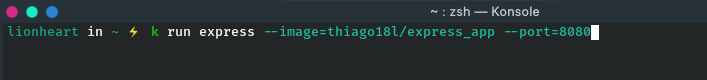
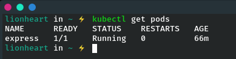

# Running your first app on Kubernetes

Because this may be your first time, you’ll use the simplest possible way of running an
app on Kubernetes. Usually, you’d prepare a JSON or YAML manifest, containing a
description of all the components you want to deploy, but because we haven’t talked
about the types of components you can create in Kubernetes yet, you’ll use a simple
one-line command to get something running.

## Deploying your Node.js app

The simplest way to deploy your app is to use the kubectl run command, which will
create all the necessary components without having to deal with JSON or YAML. This
way, we don’t need to dive into the structure of each object yet. Try to run the image
you created and pushed to Docker Hub earlier. Here’s how to run it in Kubernetes:



**OBS** - *the command **`k`** is a alias for kubectl*

The **--image=thiago18l/express_app** part obviously specifies the container image you want to
run, and the --port=8080 option tells Kubernetes that your app is listening on port
8080.

## Introduction to pods

You may be wondering if you can see your container in a list showing all the running
containers. Maybe something such as kubectl get containers ? Well, that’s not exactly
how Kubernetes works. It doesn’t deal with individual containers directly. Instead, it
uses the concept of multiple co-located containers. This group of containers is called
a Pod.

A pod is a group of one or more tightly related containers that will always run
together on the same worker node and in the same Linux namespace(s). Each pod
is like a separate logical machine with its own IP, hostname, processes, and so on,
running a single application. The application can be a single process, running in a
single container, or it can be a main application process and additional supporting
processes, each running in its own container. All the containers in a pod will appear
to be running on the same logical machine, whereas containers in other pods, even
if they’re running on the same worker node, will appear to be running on a differ-
ent one.

## Listing pods

Because you can’t list individual containers, since they’re not standalone Kubernetes
objects, can you list pods instead? Yes, you can. Let’s see how to tell kubectl to list
pods in the following listing.

```bash
kubectl get pods
```



This is your pod. Its status is still Pending and the pod’s single container is shown as
not ready yet (this is what the 0/1 in the READY column means). The reason why the
pod isn’t running yet is because the worker node the pod has been assigned to is
downloading the container image before it can run it. When the download is finished,
the pod’s container will be created and then the pod will transition to the Running
state.